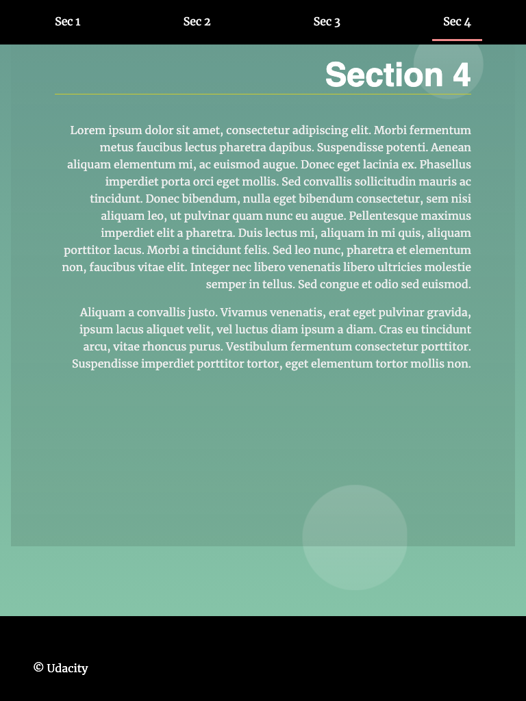

# Landing Page Project
This repository is about a static Landing Page that we make interactive using JavaScript to manipulate HTML, CSS, and the DOM. It's fun, so go check it out!

Landing page top             |  Landing page bottom
:-------------------------:|:-------------------------:
  |  

## Dependencies
No dependencies are required. Just use, e.g., Google Chrome or your modern browser of choice to display the index.html and a basic text editor such as Sublime to display and change the code.

## Functionality
The navigation menu bar is created dynamically (this is especially useful if you work with APIs and don't know the exact content upfront). If you click on a section in the menu, the page scrolls smoothly to bring it into view. `<section>`s that are active in the viewport get highlighted subtly.

## How To
First, get familiar with the `index.html` and the `styles.css` files to understand the structure of the landing page. The go over the `app.js` file to understand how we manipulate the DOM to make the page interactive.

## Extend the Project
If you want to get into Front End Web Development, you can change and extend the project. Here are some suggestions:

- Add an active state to the navigation items when a section is in the viewport.
- Hide fixed navigation bar while not scrolling (it should still be present on page load).
    - Hint: `setTimeout` can be used to check when the user is no longer scrolling.
- Add a scroll to top button on the page that’s only visible when the user scrolls below the fold of the page.
- Update/change the design/content.
- Make sections collapsible.

## Acknowledgements
This is a project for the [Udacity Front End Web Developer Nanodegree](https://www.udacity.com/course/front-end-web-developer-nanodegree--nd0011) program. Go check it out! If you want to work your way through the project yourself for learning purposes, you can find the template code [here](https://github.com/udacity/fend/tree/refresh-2019/projects/landing-page). Enjoy!